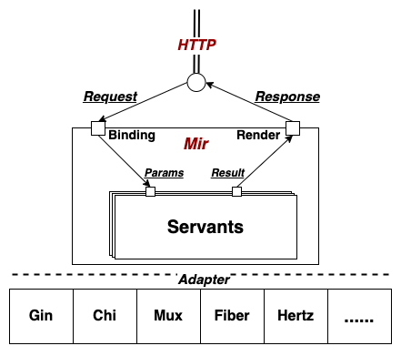

## Mir
[](https://github.com/alimy/mir/actions/workflows/go.yml)
[](https://pkg.go.dev/github.com/alimy/mir/v3)
[](https://sourcegraph.com/github.com/alimy/mir)

Mir is a toolkit to develop RESTful API backend service like develop service of gRPC. It adapt some HTTP framework sush as [Gin](https://github.com/gin-gonic/gin), [Chi](https://github.com/go-chi/chi), [Hertz](https://github.com/cloudwego/hertz), [Echo](https://github.com/labstack/echo), [Iris](https://github.com/kataras/iris), [Fiber](https://github.com/gofiber/fiber), [Macaron](https://github.com/go-macaron/macaron), [Mux](https://github.com/gorilla/mux), [httprouter](https://github.com/julienschmidt/httprouter)。  

  
 
 ### Tutorials
* Generate a simple template project
```bash
% go get github.com/alimy/mir/mirc/v3@latest
% mirc new -h
create template project

Usage:
  mirc new [flags]

Flags:
  -d, --dst string     genereted destination target directory (default ".")
  -h, --help           help for new
      --mir string     mir replace package name or place
  -p, --pkg string     project's package name (default "github.com/alimy/mir-example")
  -s, --style string   generated engine style eg: gin,chi,mux,hertz,echo,iris,fiber,fiber-v2,macaron,httprouter (default "gin")

% mirc new -d example 
% tree example
example
.
|-- Makefile
|-- README.md
|-- go.mod
|-- go.sum
|-- main.go
|-- mirc
|   |-- auto
|   |   `-- api
|   |       |-- site.go
|   |       |-- v1
|   |       |   `-- site.go
|   |       `-- v2
|   |           `-- site.go
|   |-- main.go
|   `-- routes
|       |-- site.go
|       |-- v1
|       |   `-- site.go
|       `-- v2
|           `-- site.go
`-- servants
    |-- core.go
    |-- servants.go
    |-- site.go
    |-- site_v1.go
    `-- site_v2.go

% cd example
% make generate
% make build
```
 
* RESTful API define:
```go
// file: mirc/routes.go

package routes

import (
	. "github.com/alimy/mir/v3"
	. "github.com/alimy/mir/v3/engine"
)

func init() {
	AddEntry(new(User))
}

type LoginReq struct {
	Name   string `json:"name"`
	Passwd string `json:"passwd"`
}

type LoginResp struct {
	JwtToken string `json:"jwt_token"`
}

// User user interface info
type User struct {
	Chain  Chain                          `mir:"-"`
	Group  Group                          `mir:"v1"`
	Login  func(Post, LoginReq) LoginResp `mir:"/login/"`
	Logout func(Post)                     `mir:"/logout/"`
}
```

* Stub source code generatee automatic:
```go
// file: mirc/auto/api/routes.go

// Code generated by go-mir. DO NOT EDIT.
package routes

import (
	"net/http"

	"github.com/alimy/mir/v3"
	"github.com/gin-gonic/gin"
)

type LoginReq struct {
	Name   string `json:"name"`
	Passwd string `json:"passwd"`
}

type LoginResp struct {
	JwtToken string `json:"jwt_token"`
}

type User interface {
	// Chain provide handlers chain for gin
	Chain() gin.HandlersChain

	Login(c *gin.Context, req *LoginReq) (*LoginResp, mir.Error)
	Logout(c *gin.Context) mir.Error

	mustEmbedUnimplementedUserServant()
}

type UserBinding interface {
	BindLogin(c *gin.Context) (*LoginReq, mir.Error)

	mustEmbedUnimplementedUserBinding()
}

type UserRender interface {
	RenderLogin(c *gin.Context, data *LoginResp, err mir.Error)
	RenderLogout(c *gin.Context, err mir.Error)

	mustEmbedUnimplementedUserRender()
}

// UnimplementedUserServant can be embedded to have forward compatible implementations.
type UnimplementedUserServant struct {
}

// UnimplementedSiteBinding can be embedded to have forward compatible implementations.
type UnimplementedSiteBinding struct {
	BindAny func(*gin.Context, any) mir.Error
}

// UnimplementedSiteRender can be embedded to have forward compatible implementations.
type UnimplementedSiteRender struct {
	RenderAny func(*gin.Context, any, mir.Error)
}

// RegisterUserServant register User servant to gin
func RegisterUserServant(e *gin.Engine, s User, b UserBinding, r UserRender) {
	router := e.Group("v1")
	// use chain for router
	middlewares := s.Chain()
	router.Use(middlewares...)

	// register routes info to router
	router.Handle("POST", "/login/", func(c *gin.Context) {
		select {
		case <-c.Request.Context().Done():
			return
		default:
		}

		req, err := b.BindLogin(c)
		if err != nil {
			r.RenderLogin(c, nil, err)
		}
		resp, err := s.Login(c, req)
		r.RenderLogin(c, resp, err)
	})
	router.Handle("POST", "/logout/", func(c *gin.Context) {
		select {
		case <-c.Request.Context().Done():
			return
		default:
		}
		
		r.RenderLogout(c, s.Logout(c))
	})
}

func (UnimplementedUserServant) Chain() gin.HandlersChain {
	return nil
}

func (UnimplementedUserServant) Login(c *gin.Context, req *LoginReq) (*LoginResp, mir.Error) {
	return nil, mir.Errorln(http.StatusNotImplemented, http.StatusText(http.StatusNotImplemented))
}

func (UnimplementedUserServant) Logout(c *gin.Context) mir.Error {
	return mir.Errorln(http.StatusNotImplemented, http.StatusText(http.StatusNotImplemented))
}

func (UnimplementedUserServant) mustEmbedUnimplementedUserServant() {}

func (b UnimplementedUserBinding) BindLogin(c *gin.Context) (*LoginReq, mir.Error) {
	obj := new(LoginReq)
	err := b.BindAny(c, obj)
	return obj, err
}

func (b UnimplementedUserBinding) mustEmbedUnimplementedUserBinding() {}

func (r UnimplementedUserRender) RenderLogin(c *gin.Context, data *LoginResp, err mir.Error) {
	r.RenderAny(c, data, err)
}

func (r UnimplementedUserRender) RenderLogout(c *gin.Context, err mir.Error) {
	r.RenderAny(c, nil, err)
}

func (r UnimplementedUserRender) mustEmbedUnimplementedUserRender() {}

```

* API interface implement:   
```go
// file: servants/user.go

package servants

import (
	"github.com/alimy/mir-example/v3/mirc/auto/api"
)

type userSrv struct {
	api.UnimplementedUserServant
}

type userBinding struct {
	*api.UnimplementedUserBinding
}

type userRender struct {
	*api.UnimplementedUserRender
}

func newUserSrv() api.Site {
	return &userSrv{}
}

func newUserBinding() api.SiteBinding {
	return &siteBinding{
		UnimplementedSiteBinding: &api.UnimplementedSiteBinding{
			BindAny: bindAny,
		},
	}
}

func newUserRender() api.SiteRender {
	return &siteRender{
		UnimplementedSiteRender: &api.UnimplementedSiteRender{
			RenderAny: renderAny,
		},
	}
}

func bindAny(c *gin.Context, obj any) mir.Error {
	if err != c.ShouldBind(obj); err != nil {
		return mir.NewError(http.StatusBadRequest, err)
	}
	return nil
}

func renderAny(c *gin.Context, data any, err mir.Error) {
	if err == nil {
		c.JSON(http.StatusOK, data)
	} else {
		c.JSON(err.StatusCode(), err.Error())
	}
}
```

* Service register:  
```go
// file: servants/servants.go

package servants

import (
	"github.com/alimy/mir-example/v3/mirc/auto/api"
	"github.com/gin-gonic/gin"
)

// RegisterServants register all the servants to gin.Engine
func RegisterServants(e *gin.Engine) {
	api.RegisterUserServant(e, newUserSrv(), newUserBinding(), newUserRender())
	
	// TODO: some other servant to register
}
```

### Projects that used [go-mir](https://github.com/alimy/mir) 
 * [examples](examples)  
[go-mir](https://github.com/alimy/mir)'s demo example to describe how to use [Mir](https://github.com/alimy/mir) to develop RESTful API backend service quickly.
